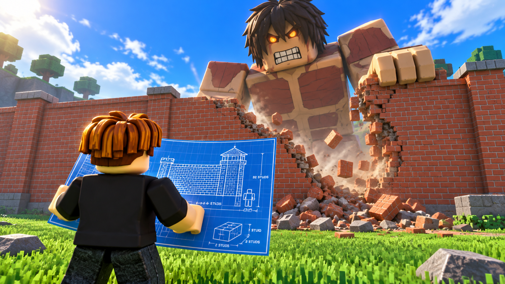

# buil a wall — концепт игры

Восстановлено по обсуждению проекта. Актуальная игровая версия — 0.7, 26 сентября 2026 года. Этот документ сохраняет основную идею, принятые решения и вопросы для дальнейшего развития.

## Идея в одном абзаце

Игрок строит и улучшает стену, которая защищает небольшой город от огромных титанов. Каждая секция одновременно приносит деньги и стреляет из пушки. При приближении титана нужно определить, какую секцию он атакует, и успеть усилить её или подготовить ремонт. Чем крепче оборона, тем выше доход и тем более сильного врага можно пережить. В перспективе игру предполагается реализовать в Roblox; сейчас её основной цикл проверяется в браузерном 2D-прототипе.

## Роль игрока и цель

Игрок — инженер и защитник города. Он перемещается внутри города за линией стен, выбирает места строительства, расходует заработанные деньги и поддерживает оборону. Пушки стреляют автоматически: основной выбор игрока связан со строительством и распределением денег, а не с прицеливанием.

Цель текущего забега — пережить шесть уровней атак и сохранить ратушу. Если здоровье ратуши падает до нуля, забег заканчивается поражением.

## Основной игровой цикл

**Построить секцию → получить доход → построить остальные секции → улучшить оборону → выдержать атаку → отремонтировать повреждения → подготовиться к более сильному титану.**

Стена выполняет три функции: защищает город, зарабатывает деньги и наносит урон. Поэтому потеря секции ослабляет и защиту, и экономику. У игрока есть выбор: вложиться в следующую ступень силы, восстановить потерянную секцию или оплатить ремонт той, которую уже атакуют.

## Экран и пространство

- Базовый размер сцены — 1920 × 1080; игра масштабируется под размер окна.
- Верхние 70% экрана занимает поле, по которому сверху подходят титаны.
- На границе поля и города проходит горизонтальная линия из шести секций стены.
- Нижние 30% — город с инженером, ратушей и магазином. Инженер всегда остаётся за стеной, в том числе после прорыва.
- Соседних игроков и соседних участков в текущем прототипе нет.
- Каждая секция имеет свой уровень, здоровье и пушку. У титанов есть здоровье и уровень силы.

Цель титана должна быть понятна издалека. Выбранная секция подсвечивается, путь показывается пунктиром и стрелками. Цели выбираются случайно, но во время подхода конкретный титан сохраняет выбранную цель.

## Главный экран и визуальное направление

При входе показывается иллюстрация: персонаж в Roblox-стиле стоит спиной к зрителю и держит чертёж; перед ним полуразрушенная кирпичная стена, за ней огромный блочный титан. Справа — зелёная кнопка «Начать играть». До нажатия игровой таймер и экономика остановлены.

Визуальное направление: яркие цвета, понятные силуэты, блочные персонажи, крупный масштаб монстра относительно строителя. В текущем геймплее используются оригинальные пиксельные спрайты, а иллюстрация служит стартовым экраном и ориентиром для дальнейшего художественного оформления.

Интерфейс магазина — белая панель с объёмными цветными карточками, иконками материалов и зелёными кнопками. Дерево обозначается коричневым, камень — серебристым; следующие материалы отличаются цветом и рисунком. Валюта отображается зелёными долларами. Купюры вылетают из стен и летят в кассу; касса подсвечивается при пополнении.

## Первые действия и короткое обучение

1. После «Начать играть» у игрока есть $20 и шесть зелёных точек. Готовых стен и дохода нет.
2. Игрок нажимает на точку или подходит к ней вручную. Рядом появляется кнопка «Купить стену · $20».
3. Покупка сразу создаёт деревянную секцию с пушкой. Первая выплата $5 приходит через секунду; затем деньги поступают каждую секунду.
4. За четыре секунды первая секция зарабатывает на вторую. Игрок последовательно покупает остальные стены, каждая тоже стоит $20 и добавляет $5/сек. Порядок выбора точек свободный.
5. После шестой постройки общий доход равен $30/сек. Открываются магазин и улучшения; начинается отсчёт 10 секунд до первого титана.
6. Последняя подсказка предлагает улучшить стену и следить за направлением атаки.

Обучение проходит на самом игровом поле. Его подсказки можно пропустить, но условие постройки шести секций остаётся. Пока первоначальная оборона не собрана, титаны не появляются.

## Улучшение, установка и ремонт

Нажатие на построенную секцию открывает меню над ней: текущие характеристики, следующий уровень, цена и информация о том, хватает ли денег.

**Любое улучшение или восстановление через меню занимает 2 игровые секунды.** Над стеной видны оставшееся время и полоса прогресса. До завершения действуют прежние характеристики, после завершения включаются новый уровень, здоровье, урон и доход. Цена списывается при старте один раз. Повторная покупка и другая работа во время установки заблокированы. Если прямое улучшение прерывается движением, переходом в магазин или атакой, его стоимость возвращается. Пауза останавливает таймер.

Магазин даёт второй способ строительства: купить комплект нужного уровня, подойти к секции и установить его за 2 секунды. В рюкзаке помещается один комплект. При прерывании установки комплект сохраняется; у торговца его можно вернуть за полную цену. Нажатие на магазин быстро переносит инженера к прилавку.

Под атакой нельзя начать улучшение или замену секции. Ремонт разрешён даже во время боя: инженер подходит к стене и восстанавливает здоровье за деньги. Разрушенная секция требует восстановления или замены. Уже открытые улучшения и магазин не блокируются повторно после разрушения стены.

## Титаны и волны

Титаны медленно идут сверху к назначенным секциям. Пушки автоматически обстреливают врагов в радиусе действия. Дойдя до стены, титан наносит периодические удары. Если секция разрушена, он проходит через брешь и направляется к ратуше.

В прототипе шесть уровней, число титанов по уровням: **1, 1, 2, 2, 3, 3**. Здоровье и урон врагов растут. После гибели последнего врага начинается перерыв на 10 игровых секунд. До этого следующий уровень не запускается. Деньги, улучшения, повреждения и купленный комплект сохраняются между уровнями.

## Текущие числовые параметры

Это параметры для проверки прототипа, а не окончательный баланс Roblox-версии.

| Уровень | Материал | Цена, $ | Здоровье | Урон пушки за выстрел | Доход, $/сек |
|---|---|---:|---:|---:|---:|
| 1 | Дерево | 20 | 180 | 6 | 5 |
| 2 | Камень | 400 | 600 | 19 | 10 |
| 3 | Сталь | 1100 | 1250 | 43 | 18 |
| 4 | Бастион | 2800 | 2400 | 86 | 30 |
| 5 | Цитадель | 7000 | 4400 | 160 | 50 |

Ратуша имеет 1200 HP. Живые секции дают доход, разрушенные — нет. Пушка стреляет раз в секунду в радиусе 230 игровых единиц.

Ремонт стоит $0,15 за 1 HP, длится до 4 секунд за действие и восстанавливает `32 + max_hp × 0.025` HP/сек. Движение прерывает работу.

Для титана уровня L: здоровье `round(900 × 1.25^(L − 1))`, урон по стене `round(30 × 1.20^(L − 1))` раз в 1,6 секунды, награда `round(250 × 1.25^(L − 1))`. По ратуше наносится удвоенный урон. Скорость движения в текущих шести уровнях — 8,25–9,5 игровых единиц/сек.

## Что проверяем прототипом

Главная гипотеза: сочетание дохода от стены и угрозы её потери создаёт понятный и интересный выбор — куда вложиться до следующего удара.

Во время живого плейтеста нужно проверить:

- Понимает ли новичок без объяснений, как подойти к зелёной точке и купить первую секцию?
- Замечает ли он, что именно стены дают деньги, и понятно ли ожидание следующей выплаты?
- Интересно ли строить все шесть секций, или эта часть становится повторяющейся обязанностью?
- Видна ли цель титана достаточно рано, чтобы успеть принять решение?
- Есть ли выбор между ремонтом и улучшением, или один вариант всегда очевидно выгоднее?
- Понятны ли таймер установки, запрет улучшения под атакой и причина поражения?

Автоматические проверки подтверждают работу правил, но сами по себе не доказывают, что игра увлекательна. Оценку темпа, напряжения и удобства нужно получать из реальных прохождений.

## Направление дальнейшей разработки

Подтверждённое направление — использовать 2D-прототип для проверки основного цикла и затем реализовать игру в Roblox. Перед переносом стоит зафиксировать результаты плейтестов и уточнить баланс дохода, цен, времени установки, ремонта и силы титанов.

Отдельно предстоит решить, нужны ли сетевые соседние участки, кооперация, сохранение прогресса и более длинная прогрессия. Эти возможности сейчас не реализованы и не считаются утверждёнными правилами. В прототипе также нет звука и Roblox-кода.

Для Roblox-версии рекомендуется проверять покупки, доход, урон и завершение установки на сервере; клиенту оставить отображение, эффекты и ввод. Это техническое предложение для будущей реализации.

## Какие прежние идеи заменены

В исходной задумке игрок начинал с готовой стеной первого уровня, а первая атака приходила через четыре минуты. По последующим правкам текущая версия начинается с пустых точек, и первая атака запускается через 10 секунд после строительства шестой секции. Вариант с соседними игроками был убран из прототипа. Линия стены теперь горизонтальная, город расположен снизу, а титаны идут сверху.

При дальнейшем развитии ориентироваться на актуальные правила выше. Старые варианты сохранены здесь только для восстановления контекста.
